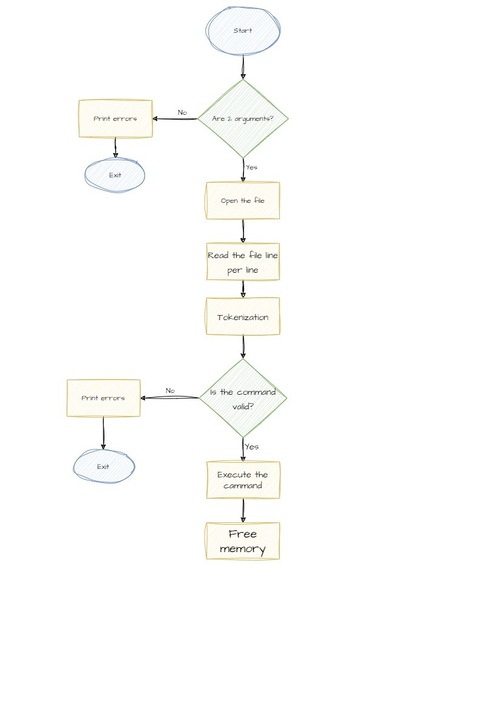

# MONTY

## Description
Monty 0.98 is a scripting language that is first compiled into Monty byte codes (Just like Python). It relies on a unique stack, with specific instructions to manipulate it. The goal of this project is to create an interpreter for Monty ByteCodes files.

## List of Files

| File Name | Description |
|---------------- | -----------|
|[monty.h](./monty.h)    | Declaration of all functions to be used in the program, as well as libriaries and global variables|
|[main.c](./main.c) | Principal function|
|[operations.c](./operations.c) | Contains the functions to be used |
|[operations2.c](./operations2.c) | Contains the functions to be used |
|[errors_file.c](./errors_file.c) |Contains all the posibles exits to the program |
|[errors_file_2.c](./errors_file_2.c) |Contains all the posibles exits to the program |
|[executer.c](./executer.c) | Contains the functions to open and read the file to execute|
|[opcodes.c](./opcodes.c) | Contains the functions to call the functions to be execute|
|[helper_functions.c](./herlper_functions.c) | Contains the functions like _strcmp and others, to be called in another file|

## Bugs
If you find any bug, please, let me know.

## Authors
* **Obed Rayo** [Github](https://github.com/ObedRav)
* **Camilo Zapata** [Github](https://github.com/ZapataCamilo)
